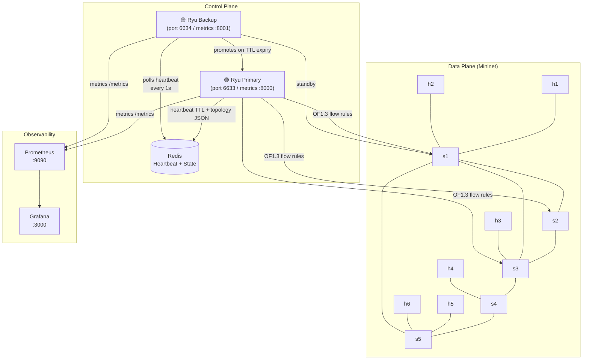

# Architecture

## System Overview

This project implements a production-grade SDN controller with controller high availability, weighted routing, and full observability.



## Component Descriptions

### `ryu_controller/topology_graph.py`
Pure-Python (no Ryu imports) graph engine. Provides:
- `weighted_dijkstra(src, dst)` — composite cost = α·latency + β·(1/bw) + γ·loss
- `ecmp_paths(src, dst)` — returns up to 4 equal-cost paths
- `to_dict()` / `from_dict()` — serialisation for Redis state sync

### `ryu_controller/sdn_controller.py`
Ryu `RyuApp` subclass using OpenFlow 1.3:
- Table-miss entries, buffer_id handling, meter bands
- LLDP echo round-trip latency probing (background thread)
- `OFPPortStatsRequest` polling every 5 s for utilization-aware routing
- `EventLinkAdd/Delete` from `ryu.topology` for live graph updates
- OF1.3 Group Tables for ECMP traffic splitting

### `ha/`
- `state_sync.py` — Redis heartbeat TTL + JSON topology push/pull
- `primary.py` — writes heartbeat every 2 s; pushes graph state
- `backup.py` — `LeaderElection` state machine (WATCHING → PROMOTING → PRIMARY)

### `ryu_controller/metrics_exporter.py`
Prometheus metrics exposed on `:8000`:
- `sdn_link_up{src, dst}` — gauge per link
- `sdn_flow_install_total` — counter
- `sdn_recovery_time_ms` — histogram (5 ms to 2.5 s buckets)
- `sdn_active_flows` — gauge
- `sdn_controller_role` — 1=primary, 0=backup

### `chaos_test.py`
Automated chaos harness:
- Starts Mininet with chosen topology
- Randomly kills 1–3 links at random intervals
- Polls `/recovery-log` REST API after each failure
- Outputs p50/p95/p99 recovery times and matplotlib chart

### `pcap_analysis.py`
tshark-based packet-level proof:
- Captures OF control channel during test
- Asserts `OFPT_PORT_STATUS(down)` → `OFPT_FLOW_MOD` within recovery window

## Data Flow: Link Failure Sequence

```
1. Mininet: link s1-s2 goes DOWN
2. OVS kernel: sends OFPT_PORT_STATUS to primary controller
3. sdn_controller: EventLinkDelete handler fires
4. topology_graph.remove_link(s1, s2)
5. Find affected active_paths that traverse s1↔s2
6. For each path: delete stale flows (OFPFC_DELETE to each switch)
7. ecmp_paths(src_dpid, dst_dpid) → new shortest path via Dijkstra
8. _install_path → OFPFC_ADD on each switch in new path
9. recovery_log.append({recovery_ms: ...})  ← measured here
10. Prometheus: recovery_time_ms.observe(elapsed_ms)
```

## File Structure

```
sdn-link-failure/
├── legacy/                  # POX v1 prototype (preserved for growth story)
├── ryu_controller/          # Ryu OF1.3 controller + graph engine
├── ha/                      # Primary/backup + Redis leader election
├── topologies/              # Ring, mesh, fat-tree Mininet topologies
├── tests/                   # pytest: topology graph, HA, weight function
├── benchmarks/              # Chaos test output: results.md + chart.png
├── docker/                  # Dockerfile + Grafana provisioning
├── chaos_test.py            # Chaos engineering harness
├── pcap_analysis.py         # OpenFlow pcap assertion tool
├── docker-compose.yml       # Full stack in one command
├── prometheus.yml           # Scrape config
└── .github/workflows/       # Tests + lint + Docker build CI
```
